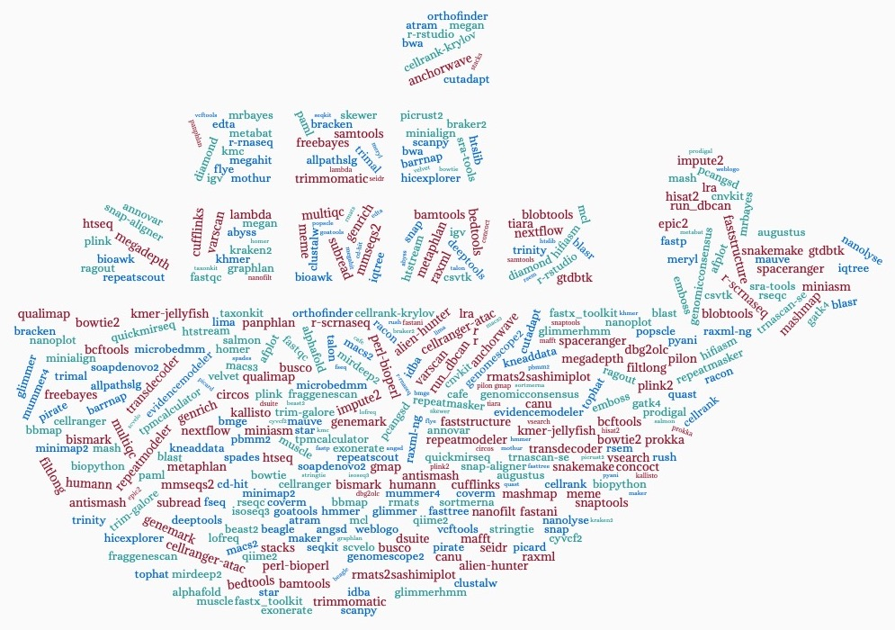

.. RCAC Biocontainers documentation master file, created by
   sphinx-quickstart on Wed Mar  2 21:59:37 2022.
   You can adapt this file completely to your liking, but it should at least
   contain the root `toctree` directive.

RCAC Biocontainers documentation!
==============================================

This is the user guide for biocontainer modules deployed in Purdue High Performance Computing clusters. More information about our center is avaiable here (https://www.rcac.purdue.edu).  

If you have any question, contact me(Yucheng Zhang) at: 
`zhan4429@purdue.edu <mailto:zhan4429@purdue.edu>`_

.. warning::
    Do not use both ``bioinfo`` and ``biocontainers`` in your job script, because loading ``bioinfo`` will cause the failure of loading many modules including ``biocontainers`` in ``Brown``, ``Halstead``, ``Scholar``, ``Workbench``, and ``Gilbreth``. Since RCAC will not provide support to ``bioinfo`` in the future clusters, we recommend users to just use ``biocontainers``. 

.. toctree::
   :caption: Frequently Asked Questions
   :titlesonly:

   faq

.. toctree::
   :caption: Singularity
   :titlesonly:

   singularity

.. toctree::
   :caption: Application list
   :maxdepth: 3
   :titlesonly:
   
   source/abacas/abacas
   source/abricate/abricate
   source/abyss/abyss
   source/actc/actc
   source/advntr/advntr
   source/afplot/afplot
   source/afterqc/afterqc
   source/agat/agat
   source/alfred/alfred
   source/alien-hunter/alien-hunter
   source/alignstats/alignstats
   source/allpathslg/allpathslg
   source/alphafold/alphafold
   source/amptk/amptk
   source/anchorwave/anchorwave
   source/angsd/angsd
   source/annogesic/annogesic
   source/annovar/annovar
   source/antismash/antismash
   source/anvio/anvio
   source/any2fasta/any2fasta
   source/asgal/asgal
   source/assembly-stats/assembly-stats
   source/atac-seq-pipeline/atac-seq-pipeline
   source/ataqv/ataqv
   source/atram/atram
   source/atropos/atropos
   source/augur/augur
   source/augustus/augustus
   source/bactopia/bactopia
   source/bali-phy/bali-phy
   source/bamgineer/bamgineer
   source/bamliquidator/bamliquidator
   source/bam-readcount/bam-readcount
   source/bamsurgeon/bamsurgeon
   source/bamtools/bamtools
   source/bamutil/bamutil
   source/barrnap/barrnap
   source/basenji/basenji
   source/bbmap/bbmap
   source/bcftools/bcftools
   source/bcl2fastq/bcl2fastq
   source/beagle/beagle
   source/beast2/beast2
   source/bedops/bedops
   source/bedtools/bedtools
   source/bioawk/bioawk
   source/biobambam/biobambam
   source/bioconvert/bioconvert
   source/biopython/biopython
   source/bismark/bismark
   source/blasr/blasr
   source/blast/blast
   source/blobtools/blobtools
   source/bmge/bmge
   source/bowtie/bowtie
   source/bowtie2/bowtie2
   source/bracken/bracken
   source/braker2/braker2
   source/brass/brass
   source/breseq/breseq
   source/busco/busco
   source/bustools/bustools
   source/bwa/bwa
   source/bwameth/bwameth
   source/cactus/cactus
   source/cafe/cafe
   source/canu/canu
   source/ccs/ccs
   source/cdbtools/cdbtools
   source/cd-hit/cd-hit
   source/cegma/cegma
   source/cellbender/cellbender
   source/cellphonedb/cellphonedb
   source/cellranger/cellranger
   source/cellranger-arc/cellranger-arc
   source/cellranger-atac/cellranger-atac
   source/cellrank/cellrank
   source/cellrank-krylov/cellrank-krylov
   source/cellsnp-lite/cellsnp-lite
   source/celltypist/celltypist
   source/centrifuge/centrifuge
   source/checkm-genome/checkm-genome
   source/chromap/chromap
   source/cicero/cicero
   source/circlator/circlator
   source/circos/circos
   source/ciriquant/ciriquant
   source/clair3/clair3
   source/clairvoyante/clairvoyante
   source/clever-toolkit/clever-toolkit
   source/clustalw/clustalw
   source/cnvkit/cnvkit
   source/cnvnator/cnvnator
   source/coinfinder/coinfinder
   source/concoct/concoct
   source/control-freec/control-freec
   source/cooler/cooler
   source/coverm/coverm
   source/crisprcasfinder/crisprcasfinder
   source/crispresso2/crispresso2
   source/crispritz/crispritz
   source/crossmap/crossmap
   source/cross_match/cross_match
   source/csvtk/csvtk
   source/cufflinks/cufflinks
   source/cutadapt/cutadapt
   source/cyvcf2/cyvcf2
   source/dbg2olc/dbg2olc
   source/deepbgc/deepbgc
   source/deepconsensus/deepconsensus
   source/deepsignal2/deepsignal2
   source/deeptools/deeptools
   source/deepvariant/deepvariant
   source/delly/delly
   source/diamond/diamond
   source/dnaio/dnaio
   source/dragonflye/dragonflye
   source/drep/drep
   source/dropest/dropest
   source/dsuite/dsuite
   source/easysfs/easysfs
   source/edta/edta
   source/eggnog-mapper/eggnog-mapper
   source/emboss/emboss
   source/ensembl-vep/ensembl-vep
   source/epic2/epic2
   source/evidencemodeler/evidencemodeler
   source/exonerate/exonerate
   source/fasta3/fasta3
   source/fastani/fastani
   source/fastp/fastp
   source/fastqc/fastqc
   source/fastq_pair/fastq_pair
   source/fastq-scan/fastq-scan
   source/fastspar/fastspar
   source/faststructure/faststructure
   source/fasttree/fasttree
   source/fastx_toolkit/fastx_toolkit
   source/filtlong/filtlong
   source/flye/flye
   source/fraggenescan/fraggenescan
   source/fraggenescanrs/fraggenescanrs
   source/freebayes/freebayes
   source/fseq/fseq
   source/funannotate/funannotate
   source/fwdpy11/fwdpy11
   source/gadma/gadma
   source/gamma/gamma
   source/gatk/gatk
   source/gatk4/gatk4
   source/gemma/gemma
   source/gemoma/gemoma
   source/genemark/genemark
   source/genemarks-2/genemarks-2
   source/genomepy/genomepy
   source/genomescope2/genomescope2
   source/genomicconsensus/genomicconsensus
   source/genrich/genrich
   source/gfastats/gfastats
   source/gffcompare/gffcompare
   source/gffread/gffread
   source/glimmer/glimmer
   source/glimmerhmm/glimmerhmm
   source/glnexus/glnexus
   source/gmap/gmap
   source/goatools/goatools
   source/graphlan/graphlan
   source/graphmap/graphmap
   source/gridss/gridss
   source/gseapy/gseapy
   source/gtdbtk/gtdbtk
   source/gubbins/gubbins
   source/guppy/guppy
   source/hail/hail
   source/hap.py/hap.py
   source/helen/helen
   source/hicexplorer/hicexplorer
   source/hifiasm/hifiasm
   source/hisat2/hisat2
   source/hmmer/hmmer
   source/homer/homer
   source/how_are_we_stranded_here/how_are_we_stranded_here
   source/htseq/htseq
   source/htslib/htslib
   source/htstream/htstream
   source/humann/humann
   source/hyphy/hyphy
   source/idba/idba
   source/igv/igv
   source/impute2/impute2
   source/instrain/instrain
   source/intarna/intarna
   source/interproscan/interproscan
   source/iqtree/iqtree
   source/isoseq3/isoseq3
   source/ivar/ivar
   source/jcvi/jcvi
   source/kaiju/kaiju
   source/kallisto/kallisto
   source/khmer/khmer
   source/kmc/kmc
   source/kmer-jellyfish/kmer-jellyfish
   source/kneaddata/kneaddata
   source/kover/kover
   source/kraken2/kraken2
   source/krakentools/krakentools
   source/lambda/lambda
   source/last/last
   source/ldsc/ldsc
   source/liftoff/liftoff
   source/lima/lima
   source/lofreq/lofreq
   source/longqc/longqc
   source/lra/lra
   source/ltr_finder/ltr_finder
   source/ltrpred/ltrpred
   source/lumpy-sv/lumpy-sv
   source/lyveset/lyveset
   source/macs2/macs2
   source/macs3/macs3
   source/mafft/mafft
   source/mageck/mageck
   source/maker/maker
   source/manta/manta
   source/mapcaller/mapcaller
   source/marginpolish/marginpolish
   source/mash/mash
   source/mashmap/mashmap
   source/mashtree/mashtree
   source/mauve/mauve
   source/maxbin2/maxbin2
   source/maxquant/maxquant
   source/mcl/mcl
   source/mcscanx/mcscanx
   source/medaka/medaka
   source/megadepth/megadepth
   source/megahit/megahit
   source/megan/megan
   source/meme/meme
   source/meryl/meryl
   source/metabat/metabat
   source/metaphlan/metaphlan
   source/methyldackel/methyldackel
   source/metilene/metilene
   source/mhm2/mhm2
   source/microbedmm/microbedmm
   source/minialign/minialign
   source/miniasm/miniasm
   source/minimap2/minimap2
   source/minipolish/minipolish
   source/mirdeep2/mirdeep2
   source/mirtop/mirtop
   source/mitofinder/mitofinder
   source/mlst/mlst
   source/mmseqs2/mmseqs2
   source/mothur/mothur
   source/mrbayes/mrbayes
   source/multiqc/multiqc
   source/mummer4/mummer4
   source/muscle/muscle
   source/mutmap/mutmap
   source/mykrobe/mykrobe
   source/nanofilt/nanofilt
   source/nanolyse/nanolyse
   source/nanoplot/nanoplot
   source/nanopolish/nanopolish
   source/ncbi-amrfinderplus/ncbi-amrfinderplus
   source/ncbi-genome-download/ncbi-genome-download
   source/neusomatic/neusomatic
   source/nextalign/nextalign
   source/nextclade/nextclade
   source/nextflow/nextflow
   source/ngs-bits/ngs-bits
   source/ngsutils/ngsutils
   source/orthofinder/orthofinder
   source/paml/paml
   source/panacota/panacota
   source/panaroo/panaroo
   source/pandaseq/pandaseq
   source/pandora/pandora
   source/pangolin/pangolin
   source/panphlan/panphlan
   source/parallel-fastq-dump/parallel-fastq-dump
   source/parliament2/parliament2
   source/parsnp/parsnp
   source/pbmm2/pbmm2
   source/pcangsd/pcangsd
   source/peakranger/peakranger
   source/pepper_deepvariant/pepper_deepvariant
   source/perl-bioperl/perl-bioperl
   source/phd2fasta/phd2fasta
   source/phg/phg
   source/phrap/phrap
   source/phred/phred
   source/picard/picard
   source/picrust2/picrust2
   source/pilon/pilon
   source/pindel/pindel
   source/pirate/pirate
   source/pixy/pixy
   source/platypus/platypus
   source/plink/plink
   source/plink2/plink2
   source/plotsr/plotsr
   source/pomoxis/pomoxis
   source/popscle/popscle
   source/prinseq/prinseq
   source/prodigal/prodigal
   source/prokka/prokka
   source/proteinortho/proteinortho
   source/prothint/prothint
   source/pullseq/pullseq
   source/pvactools/pvactools
   source/pyani/pyani
   source/pybedtools/pybedtools
   source/pybigwig/pybigwig
   source/pychopper/pychopper
   source/pycoqc/pycoqc
   source/pyensembl/pyensembl
   source/pyfaidx/pyfaidx
   source/pygenometracks/pygenometracks
   source/pygenomeviz/pygenomeviz
   source/pyranges/pyranges
   source/pysam/pysam
   source/qiime2/qiime2
   source/qualimap/qualimap
   source/quast/quast
   source/quickmirseq/quickmirseq
   source/r/r
   source/racon/racon
   source/ragout/ragout
   source/ragtag/ragtag
   source/rasusa/rasusa
   source/raven-assembler/raven-assembler
   source/raxml/raxml
   source/raxml-ng/raxml-ng
   source/rebaler/rebaler
   source/reciprocal_smallest_distance/reciprocal_smallest_distance
   source/recycler/recycler
   source/repeatmasker/repeatmasker
   source/repeatmodeler/repeatmodeler
   source/repeatscout/repeatscout
   source/revbayes/revbayes
   source/rmats/rmats
   source/rmats2sashimiplot/rmats2sashimiplot
   source/rnaindel/rnaindel
   source/rnapeg/rnapeg
   source/rnaquast/rnaquast
   source/roary/roary
   source/r-rnaseq/r-rnaseq
   source/r-rstudio/r-rstudio
   source/r-scrnaseq/r-scrnaseq
   source/rsem/rsem
   source/rseqc/rseqc
   source/run_dbcan/run_dbcan
   source/rush/rush
   source/salmon/salmon
   source/sambamba/sambamba
   source/samblaster/samblaster
   source/samclip/samclip
   source/samplot/samplot
   source/samtools/samtools
   source/scanpy/scanpy
   source/scarches/scarches
   source/scgen/scgen
   source/scirpy/scirpy
   source/scvelo/scvelo
   source/scvi-tools/scvi-tools
   source/seidr/seidr
   source/sepp/sepp
   source/seqkit/seqkit
   source/shasta/shasta
   source/shorah/shorah
   source/shortstack/shortstack
   source/shovill/shovill
   source/sicer/sicer
   source/sicer2/sicer2
   source/signalp4/signalp4
   source/signalp6/signalp6
   source/simug/simug
   source/skewer/skewer
   source/slamdunk/slamdunk
   source/smoove/smoove
   source/snakemake/snakemake
   source/snap/snap
   source/snap-aligner/snap-aligner
   source/snaptools/snaptools
   source/snippy/snippy
   source/snp-dists/snp-dists
   source/snpeff/snpeff
   source/snpgenie/snpgenie
   source/snphylo/snphylo
   source/snpsift/snpsift
   source/snp-sites/snp-sites
   source/soapdenovo2/soapdenovo2
   source/sortmerna/sortmerna
   source/souporcell/souporcell
   source/sourmash/sourmash
   source/spaceranger/spaceranger
   source/spades/spades
   source/sprod/sprod
   source/squeezemeta/squeezemeta
   source/sra-tools/sra-tools
   source/stacks/stacks
   source/star/star
   source/staramr/staramr
   source/starfusion/starfusion
   source/stream/stream
   source/stringtie/stringtie
   source/strique/strique
   source/structure/structure
   source/subread/subread
   source/survivor/survivor
   source/svaba/svaba
   source/svtools/svtools
   source/svtyper/svtyper
   source/swat/swat
   source/syri/syri
   source/talon/talon
   source/targetp/targetp
   source/tassel/tassel
   source/taxonkit/taxonkit
   source/t-coffee/t-coffee
   source/tetranscripts/tetranscripts
   source/tiara/tiara
   source/tobias/tobias
   source/tombo/tombo
   source/tophat/tophat
   source/tpmcalculator/tpmcalculator
   source/transabyss/transabyss
   source/transdecoder/transdecoder
   source/transrate/transrate
   source/transvar/transvar
   source/trax/trax
   source/treetime/treetime
   source/trimal/trimal
   source/trim-galore/trim-galore
   source/trimmomatic/trimmomatic
   source/trinity/trinity
   source/trinotate/trinotate
   source/trnascan-se/trnascan-se
   source/trust4/trust4
   source/trycycler/trycycler
   source/ucsc_genome_toolkit/ucsc_genome_toolkit
   source/unicycler/unicycler
   source/vadr/vadr
   source/vardict-java/vardict-java
   source/varlociraptor/varlociraptor
   source/varscan/varscan
   source/vartrix/vartrix
   source/vatools/vatools
   source/vcf2phylip/vcf2phylip
   source/vcf-kit/vcf-kit
   source/vcftools/vcftools
   source/velocyto.py/velocyto.py
   source/velvet/velvet
   source/vg/vg
   source/viennarna/viennarna
   source/vsearch/vsearch
   source/weblogo/weblogo
   source/whatshap/whatshap
   source/wiggletools/wiggletools
   source/winnowmap/winnowmap
   source/wtdbg/wtdbg
