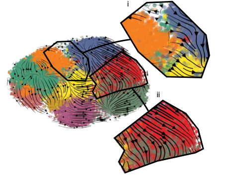

.. _backbone-label:  

CellRank
============================== 

   
Introduction
~~~~~~~
``CellRank`` a toolkit to uncover cellular dynamics based on Markov state modeling of single-cell data.
Detailed information about CellRank can be found here: https://cellrank.readthedocs.io/en/stable/. 

Versions
~~~~~~~~
- 1.5.1

Commands
~~~~~~
- python
- python3

Module
~~~~~~~
You can load the modules by::
 
   module load biocontainers  
   module load cellrank/1.5.1

.. note::
   The CellRank container also contained scVelo and scanpy. When you want to use CellRank, do not load scVelo or scanpy. 

Interactive job
~~~~~~
To run CellRank interactively on our clusters::

   (base) UserID@bell-fe00:~ $ sinteractive -N1 -n12 -t4:00:00 -A myallocation
   salloc: Granted job allocation 12345869
   salloc: Waiting for resource configuration
   salloc: Nodes bell-a008 are ready for job
   (base) UserID@bell-a008:~ $ module load biocontainers cellrank/1.5.1
   (base) UserID@bell-a008:~ $ python
   Python 3.9.9 |  packaged by conda-forge |  (main, Dec 20 2021, 02:41:03)
   [GCC 9.4.0] :: Anaconda, Inc. on linux
   Type "help", "copyright", "credits" or "license" for more information.  
   >>> import scanpy as sc
   >>> import scvelo as scv
   >>> import cellrank as cr
   >>> import numpy as np
   >>> scv.settings.verbosity = 3
   >>> scv.settings.set_figure_params("scvelo")
   >>> cr.settings.verbosity = 2
   
Batch job
~~~~~~
.. warning::
    Using ``#!/bin/sh -l`` as shebang in the slurm job script will cause the failure of some biocontainer modules. Please use ``#!/bin/bash`` instead.

To submit a sbatch job on our clusters::

    #!/bin/bash
    #SBATCH -A myallocation     # Allocation name 
    #SBATCH -t 10:00:00
    #SBATCH -N 1
    #SBATCH -n 24
    #SBATCH --job-name=cellrank
    #SBATCH --mail-type=FAIL,BEGIN,END
    #SBATCH --error=%x-%J-%u.err
    #SBATCH --output=%x-%J-%u.out

    module --force purge
    ml biocontainers cellrank/1.5.1
   
    python script.py

.. _R202: https://gtdb.ecogenomic.org 
