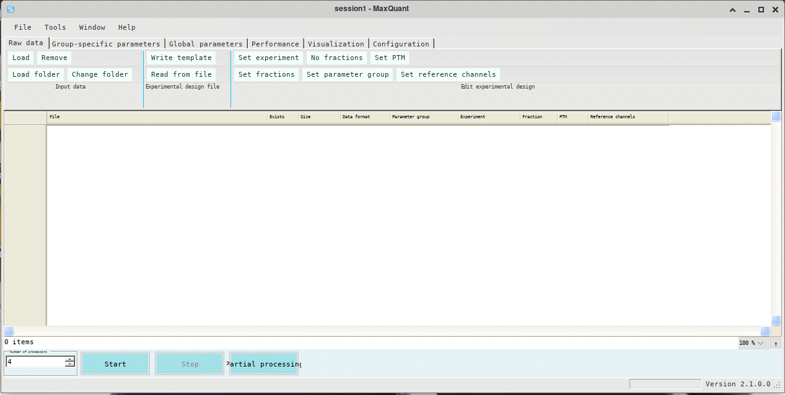

.. _backbone-label:

Maxquant
==============================

Introduction
~~~~~~~~
``Maxquant`` is a quantitative proteomics software package designed for analyzing large mass-spectrometric data sets. It is specifically aimed at high-resolution MS data. 
| For more information, please check home page: https://www.maxquant.org.

Versions
~~~~~~~~
- 2.1.0.0
- 2.1.3.0
- 2.1.4.0

Commands
~~~~~~~
- MaxQuantGui.exe
- MaxQuantCmd.exe

Module
~~~~~~~~
You can load the modules by::
    
    module load biocontainers
    module load maxquant

GUI
~~~~~
To run Maxquant with GUI, it is recommended to run within ThinLinc::

   (base) UserID@bell-fe00:~ $ sinteractive -N1 -n12 -t4:00:00 -A myallocation
   salloc: Granted job allocation 12345869
   salloc: Waiting for resource configuration
   salloc: Nodes bell-a008 are ready for job
   (base) UserID@bell-a008:~ $ module load biocontainers maxquant
   (base) UserID@bell-a008:~ $ MaxQuantGui.exe

CMD job
~~~~~
.. warning::
    Using ``#!/bin/sh -l`` as shebang in the slurm job script will cause the failure of some biocontainer modules. Please use ``#!/bin/bash`` instead.

To run Maxquant without GUI on our clusters::

    #!/bin/bash
    #SBATCH -A myallocation     # Allocation name 
    #SBATCH -t 1:00:00
    #SBATCH -N 1
    #SBATCH -n 1
    #SBATCH --job-name=maxquant
    #SBATCH --mail-type=FAIL,BEGIN,END
    #SBATCH --error=%x-%J-%u.err
    #SBATCH --output=%x-%J-%u.out

    module --force purge
    ml biocontainers maxquant

    MaxQuantCmd.exe mqpar.xml
