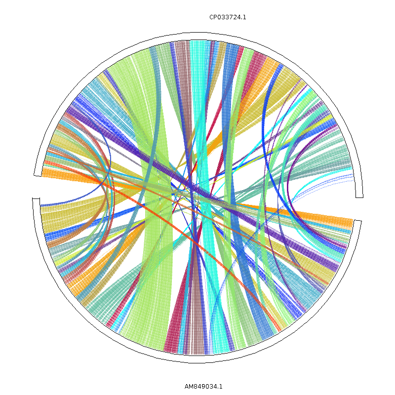

.. _backbone-label:

Mcscanx
==============================

Introduction
~~~~~~~~
The MCScanX package has two major components: a modified version of MCscan algorithm allowing users to handle MCScan more conveniently and to view multiple alignment of syntenic blocks more clearly, and a variety of downstream analysis tools to conduct different biological analyses based on the synteny data generated by the modified MCScan algorithm.
For more information, please check:
Home page: https://github.com/wyp1125/MCScanX. 

Versions
~~~~~~~~
- default

Commands
~~~~~~~
- MCScanX
- MCScanX_h
- duplicate_gene_classifier
- add_ka_and_ks_to_collinearity
- add_kaks_to_synteny
- detect_collinearity_within_gene_families
- detect_synteny_within_gene_families
- group_collinear_genes
- group_syntenic_genes
- origin_enrichment_analysis

Module
~~~~~~~~
You can load the modules by::

    module load biocontainers
    module load mcscanx

Helper command
~~~~  
.. note::
   
   To conduct downstream analyses, users need to copy the folder ``downstream_analyses`` from container into the host system. 

   A helper command ``copy_downstream_analyses`` is provided to simplify the task. Follow the procedure below to copy downstream_analyses into target directory::
   
   $ copy_downstream_analyses $PWD # this will copy the downstream_analyses into the current directory.

Example job
~~~~~
.. warning::
    Using ``#!/bin/sh -l`` as shebang in the slurm job script will cause the failure of some biocontainer modules. Please use ``#!/bin/bash`` instead.

To run mcscanx on our clusters::

    #!/bin/bash
    #SBATCH -A myallocation     # Allocation name
    #SBATCH -t 1:00:00
    #SBATCH -N 1
    #SBATCH -n 1
    #SBATCH --job-name=mcscanx
    #SBATCH --mail-type=FAIL,BEGIN,END
    #SBATCH --error=%x-%J-%u.err
    #SBATCH --output=%x-%J-%u.out

    module --force purge
    ml biocontainers mcscanx

    ## Run MCScanX
    MCScanX Result/merge
    ## Copy downstream_analyses
    copy_downstream_analyses $PWD
    ## Downstream analyses   
    java circle_plotter -g ../Result/merge.gff -s ../Result/merge.collinearity -c ../Result/merge_circ.ctl -o ../Result/merge_circle.png
    java dot_plotter -g ../Result/merge.gff -s ../Result/merge.collinearity -c ../Result/merge_dot.ctl -o ../Result/merge_dot.png
    java dual_synteny_plotter -g ../Result/merge.gff -s ../Result/merge.collinearity -c ../Result/merge_dot.ctl -o ../Result/merge_dual_synteny.png
