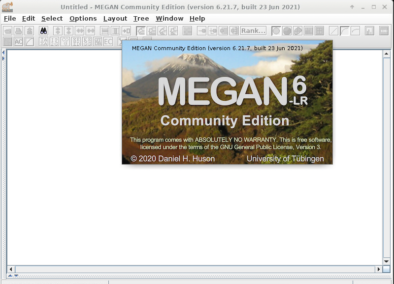

.. _backbone-label:

Megan
==============================

Introduction
~~~~~~~~
``Megan`` is a computer program that allows optimized analysis of large metagenomic datasets. Metagenomics is the analysis of the genomic sequences from a usually uncultured environmental sample. 

| For more information, please check its website: https://biocontainers.pro/tools/megan and its home page: https://uni-tuebingen.de/fakultaeten/mathematisch-naturwissenschaftliche-fakultaet/fachbereiche/informatik/lehrstuehle/algorithms-in-bioinformatics/software/megan6/.

Versions
~~~~~~~~
- 6.21.7

Commands
~~~~~~~
- MEGAN
- blast2lca
- blast2rma
- daa2info
- daa2rma
- daa-meganizer
- gc-assembler
- rma2info
- sam2rma
- references-annotator

Module
~~~~~~~~
You can load the modules by::
    
    module load biocontainers
    module load megan

GUI
~~~~
To run MEGAN with GUI, it is recommended to run within ThinLinc::

   (base) UserID@bell-fe00:~ $ sinteractive -N1 -n12 -t4:00:00 -A myallocation
   salloc: Granted job allocation 12345869
   salloc: Waiting for resource configuration
   salloc: Nodes bell-a008 are ready for job
   (base) UserID@bell-a008:~ $ module load biocontainers megan
   (base) UserID@bell-a008:~ $ MEGAN

Example job
~~~~~
.. warning::
    Using ``#!/bin/sh -l`` as shebang in the slurm job script will cause the failure of some biocontainer modules. Please use ``#!/bin/bash`` instead.

To run Megan on our clusters::

    #!/bin/bash
    #SBATCH -A myallocation     # Allocation name 
    #SBATCH -t 1:00:00
    #SBATCH -N 1
    #SBATCH -n 1
    #SBATCH --job-name=megan
    #SBATCH --mail-type=FAIL,BEGIN,END
    #SBATCH --error=%x-%J-%u.err
    #SBATCH --output=%x-%J-%u.out

    module --force purge
    ml biocontainers megan
